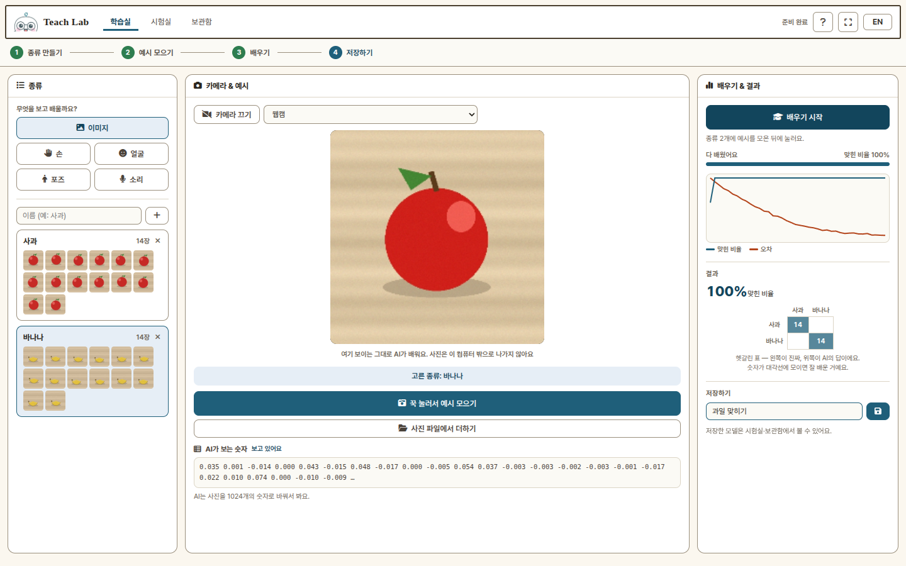
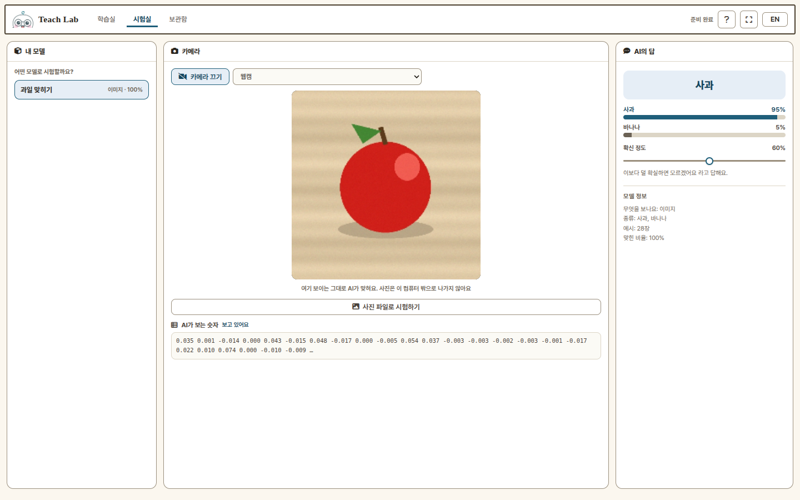
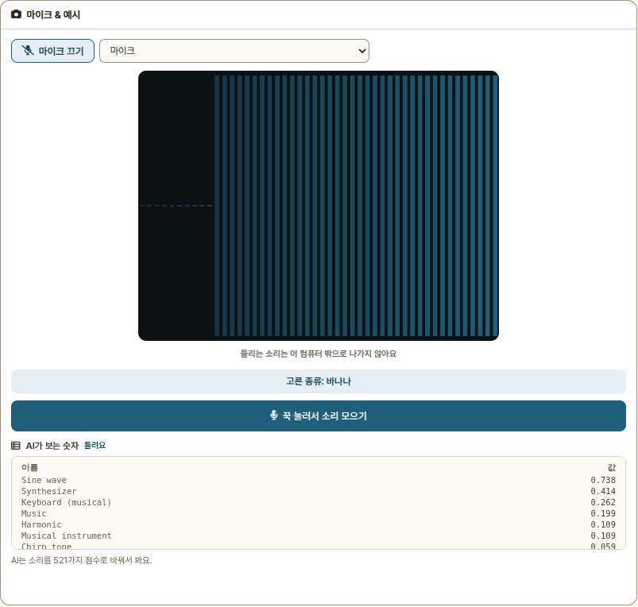
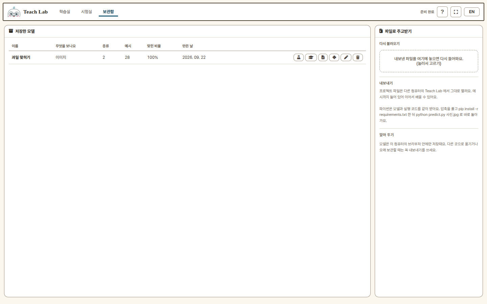

<p align="center">
  
</p>

<h1 align="center">Teach Lab</h1>

<p align="center"><b>웹캠과 마이크로 보여 준 것을, 브라우저 안에서 바로 AI에게 가르쳐요.</b></p>

<p align="center">
  <a href="https://themakerrobot.github.io/teach-lab/"><b>▶ 바로 쓰기</b></a> ·
  <a href="docs/MANUAL.md">사용 설명서</a> ·
  <a href="python/README.md">파이썬 패키지</a> ·
  <a href="https://github.com/themakerrobot/teach-lab/releases/latest">Windows 용 내려받기</a>
</p>

<p align="center">
  <a href="https://github.com/themakerrobot/teach-lab/releases/latest"></a>
  <a href="https://pypi.org/project/teachlab/"></a>
  <a href="https://github.com/themakerrobot/teach-lab/actions/workflows/ci.yml"></a>
  <a href="LICENSE"></a>
</p>



Teach Lab 은 어린이와 수업을 위한 **Teachable Machine 스타일** 웹앱입니다.
설치도 가입도 없이 크롬·엣지에서 바로 열립니다. 사진·소리는 **컴퓨터 밖으로
나가지 않고**, 학습도 브라우저 안에서 몇 초 만에 끝납니다. 배운 모델은
파일 하나로 내보내고, **파이썬에서 그대로** 돌릴 수 있어요.

## 이런 것을 가르칠 수 있어요

| 고르기 | 예를 들면 | AI가 보는 것 |
|---|---|---|
| **이미지** | 사과 / 바나나, 내 카드, 그린 그림 | 사진 그대로 (1024개 숫자) |
| **손** | 가위 / 바위 / 보, 숫자 손가락 | 손가락 관절 21점 (한 손 · 두 손) |
| **얼굴** | 웃기 / 놀라기 / 입 벌리기 | 표정 점수 52개 |
| **포즈** | 만세 / 팔짱 / 한 발 서기 | 몸의 관절 (상반신 · 전신) |
| **소리** | 박수 / 휘파람 / "안녕" | 소리 점수 521개 |

## 3분 만에 해 보기

1. [사이트를 엽니다](https://themakerrobot.github.io/teach-lab/). 카메라 권한을 물어보면 **허용**.
2. 맞히고 싶은 것마다 이름을 적고 **+** 를 누릅니다. 예: `사과`, `바나나`.
3. 종류를 하나 고른 뒤, 카메라에 보여 주면서 **꾹 눌러서 예시 모으기**를 누르고 있으면
   초당 10장씩 모입니다. 종류마다 20~40장이면 충분해요.
4. **배우기 시작**. 몇 초 뒤 맞힌 비율과 헷갈린 표가 나옵니다.
5. 이름을 붙여 **저장**하고, **시험실**에서 보여 주세요.



시험실에서는 종류별 확률이 막대로 나오고, **확신 정도**보다 덜 확실하면
*"모르겠어요"* 라고 답합니다. 이미지 모델은 사진 파일 하나로도 시험해 볼 수 있어요.

처음 들어가면 파이보가 말풍선으로 화면을 안내합니다. 헤더의 **?** 로 다시 볼 수 있고,
**EN** 을 누르면 화면 전체가 영어로 바뀝니다.

## 소리도 가르쳐요



소리를 고르면 카메라 대신 마이크가 켜집니다. 박수·휘파람·말소리처럼 **서로 다른
소리**일수록 잘 갈립니다. 조용한 상태도 종류 하나로 만들어 두면
"아무 소리 없음"을 구분할 수 있어요.

## 보관함 — 지키고, 나눠 주기



저장한 모델은 여기 모입니다. 이름을 바꾸고, **이어서 배우기**로 예시를 더 모아
다시 학습하고, 두 가지로 내보낼 수 있어요.

| 내보내기 | 받는 것 | 쓰는 곳 |
|---|---|---|
| **프로젝트 파일** `.teachlab.zip` | 모델 + 예시 + 썸네일 | 다른 컴퓨터의 Teach Lab 에 끌어다 놓으면 그대로 복원 |
| **파이썬** `-python.zip` | 모델 + 특징 모델 + 실행 코드 | 아래 "파이썬에서 그대로 쓰기" |

> 모델은 **이 컴퓨터의 브라우저 안에만** 저장됩니다.
> 재부팅하면 초기화되는 교실 PC 에서는 꼭 내보내기를 해 두세요.

## 파이썬에서 그대로 쓰기

보관함에서 🐍 **파이썬으로 내보내기**를 누르면 `과일맞히기-python.zip` 같은 파일을 받습니다.
브라우저와 **같은 모델, 같은 전처리**를 쓰므로 같은 답이 나옵니다. 인터넷도 클라우드 API 도
필요 없고, TensorFlow 도 설치하지 않습니다.

### 가장 쉬운 길 — zip 을 풀고 바로 실행

zip 안에 실행 라이브러리까지 들어 있어서, 파이썬만 있으면 됩니다.

```bash
unzip 과일맞히기-python.zip && cd 과일맞히기-python
pip install -r requirements.txt
python predict.py 사진.jpg        # 사진 한 장 → 사과 0.97
python webcam.py                  # 웹캠으로 실시간 (q 로 종료)
```

소리 모델이면 `python predict.py 소리.wav` 와 `python listen.py` 가 들어 있습니다.

### pip 패키지로 — 여러 모델을 돌릴 때

```bash
pip install teachlab                       # 이미지 모델 (약 110MB)
pip install "teachlab[webcam]"             # + 웹캠 실시간 (OpenCV)
pip install "teachlab[landmark]"           # + 손 · 얼굴 · 포즈 (MediaPipe)
pip install "teachlab[sound,mic]"          # + 소리 · 마이크
pip install "teachlab[all]"                # 전부
```

zip 을 풀지 않아도 됩니다.

```bash
teachlab info    과일맞히기-python.zip                 # 무엇을 보는지 · 종류 · 정확도
teachlab predict 과일맞히기-python.zip 사진.jpg -v     # 종류별 확률까지
teachlab webcam  과일맞히기-python.zip --threshold 0.7
teachlab listen  소리맞히기-python.zip                 # 소리 모델 · 마이크
```

내 프로그램에 넣을 때는 이렇게 씁니다.

```python
from teachlab import Model

m = Model("과일맞히기-python.zip")        # 풀어 둔 폴더나 model/ 폴더도 됩니다
r = m.predict_file("사진.jpg")
print(r.label, r.score)                   # 사과 0.97
print(r.probs)                            # {'사과': 0.97, '바나나': 0.03}
```

```python
import cv2
cap = cv2.VideoCapture(0)
while True:
    ok, frame = cap.read()
    r = m.predict_webcam(frame)           # 웹캠 프레임은 이걸로 — 학습할 때와 같은 방향
    print(r.label if r else "아직 안 보여요")
```

| 모델 | 필요한 것 | 대략 용량 |
|---|---|---|
| 이미지 | numpy · Pillow · LiteRT | 110MB |
| 손 · 얼굴 · 포즈 · 소리 | + MediaPipe | 800MB |

> 이미지 모델은 웹캠을 **거울**로 두고 배우기 때문에 파이썬에서도 웹캠 프레임은
> `predict_webcam()` 으로 넣습니다. 로봇 카메라처럼 거울이 아닌 화면은 `predict()` 를 쓰세요.
> 손·얼굴·포즈는 뒤집지 않습니다 (뒤집으면 왼손·오른손이 바뀌어요).

API 전체와 동작 원리는 [`python/README.md`](python/README.md) 에 있습니다.

## 인터넷 없이 쓰기

- **Windows**: [Releases](https://github.com/themakerrobot/teach-lab/releases/latest) 에서 `TeachLab.exe` 를 받아
  더블클릭하면 브라우저가 열립니다. 사이트 전체가 들어 있어서 (약 75MB) 오프라인 교실에서도 됩니다.
- **태블릿 · 폰**: 크롬에서 한 번 연 뒤 "홈 화면에 추가"하면 앱처럼 열리고, 그 뒤로는 인터넷 없이도 동작합니다.
- **웹**: 한 번 로드한 뒤에는 오프라인이어도 동작합니다.

## 자주 묻는 것

| 궁금한 것 | 답 |
|---|---|
| 사진이 어디로 가나요? | 어디로도 안 갑니다. 서버가 없고 전부 브라우저 안에서 돕니다. 저장하는 것도 사진이 아니라 숫자(특징)와 작은 썸네일뿐이에요 |
| 어떤 브라우저에서 되나요? | PC · 태블릿 · 폰의 크롬 · 엣지. 사파리는 일부 기능이 느릴 수 있어요 |
| 잘 못 맞혀요 | 예시를 더 모으고, 배경·밝기·각도를 조금씩 바꿔 가며 모으세요. 종류마다 예시 수를 비슷하게 맞추면 좋아요 |
| 아무거나 다 맞힌다고 해요 | 시험실의 **확신 정도**를 올리거나, "아무것도 없음" 종류를 하나 만드세요 |
| 저장한 모델이 사라졌어요 | 브라우저 기록을 지우면 같이 지워집니다. 보관함에서 프로젝트 파일로 내보내 두세요 |
| Teachable Machine 과 뭐가 다른가요? | 화면과 문구가 어린이용이고, 손·얼굴·포즈·소리를 MediaPipe 로 봅니다. 이미지는 TM 과 같은 가운데 정사각형·거울 방식이라 보이는 대로 배워요. 파이썬 내보내기가 TensorFlow 없이 돕니다 |

더 자세한 사용법은 **[사용 설명서](docs/MANUAL.md)** 에 그림으로 정리해 두었어요.

## 버전

| 무엇 | 지금 | 어디서 |
|---|---|---|
| 웹앱 · `TeachLab.exe` | [Releases](https://github.com/themakerrobot/teach-lab/releases) 의 최신 `v*` | 사이트는 늘 최신, exe 는 Release 에 첨부 |
| 파이썬 `teachlab` | [PyPI](https://pypi.org/project/teachlab/) | `pip install -U teachlab` |

바뀐 내용은 [CHANGELOG.md](CHANGELOG.md) 에 있습니다.

## 함께 보기

- [Sense Lab](https://github.com/themakerrobot/sense-lab) — 손 · 얼굴 · 포즈 · 소리를 숫자로 보는 자매 서비스. 화면 규격이 같습니다.
- 개발 · 배포 · 릴리스 절차는 [DEVELOP.md](DEVELOP.md) 에 있습니다.

## 라이선스

[MIT](LICENSE)
