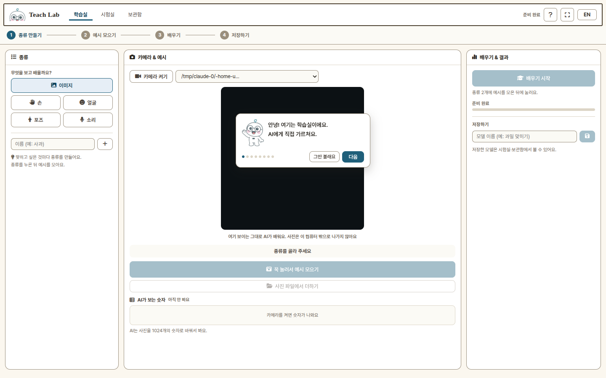
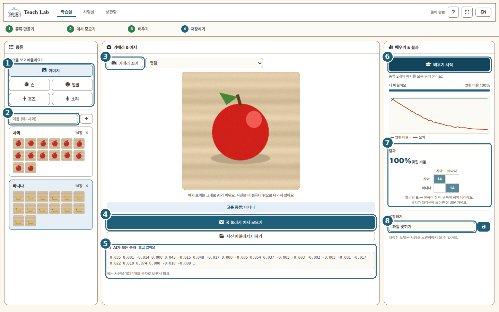
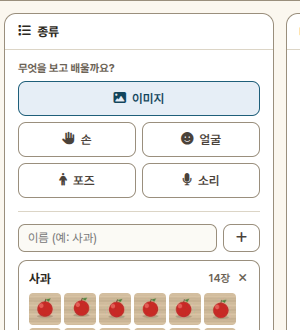
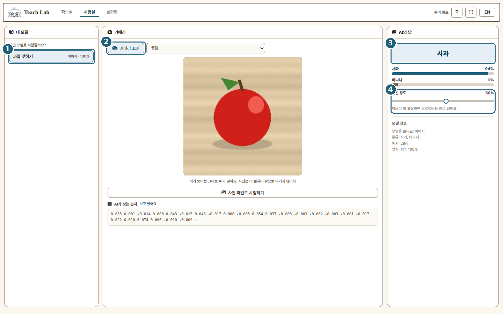
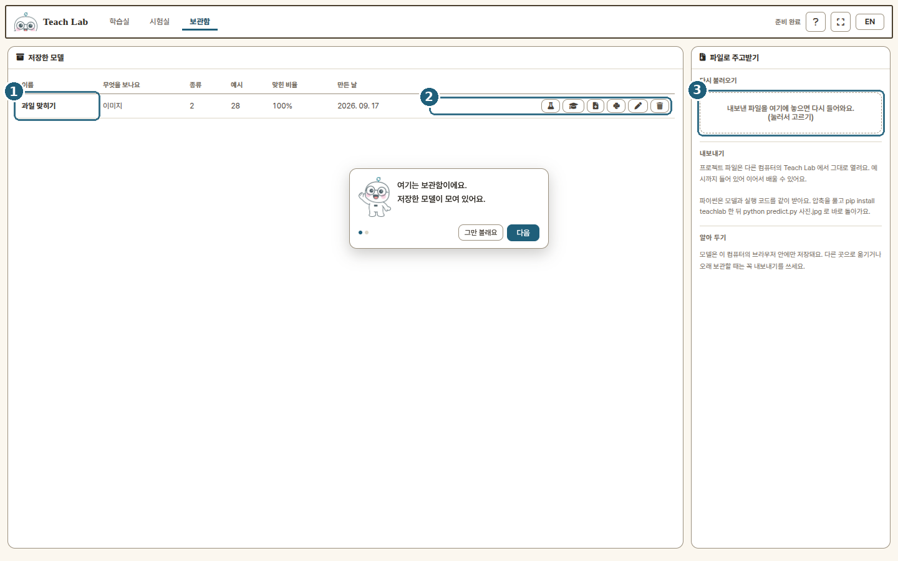

# 사용 설명서

Teach Lab 은 세 개의 방으로 되어 있어요.
**학습실**에서 가르치고, **시험실**에서 시험하고, **보관함**에 보관해요.

> 그림 속 화면은 예시로 만든 장면이에요. 실제로는 여러분의 카메라가 보여요.

---

## 처음 들어오면

파이보가 말풍선으로 화면을 한 바퀴 안내해요.
**그만 볼래요**를 눌러 건너뛸 수 있고, 헤더의 **?** 버튼으로 언제든 다시 볼 수 있어요.

---

## 1. 학습실 — 가르치기

**① 무엇을 보고 배울까요**
다섯 가지 중에 하나를 골라요.

| 고르기 | 이럴 때 써요 |
|---|---|
| **이미지** | 물건·카드·그림을 보여 주고 맞히게 할 때 |
| **손** | 가위바위보처럼 손 모양을 가르칠 때 (한 손 / 두 손) |
| **얼굴** | 웃기·입 벌리기 같은 표정을 가르칠 때 |
| **포즈** | 만세·팔짱처럼 몸 동작을 가르칠 때 (상반신 / 전신) |
| **소리** | 박수·휘파람·말소리를 가르칠 때 (마이크를 써요) |

손과 포즈는 바로 밑에서 하나 더 골라요 — **한 손 / 두 손**, **상반신 / 전신**.
두 손을 쓰는 동작이나 춤이면 넓은 쪽을 고르세요.

**② 종류 만들기**
맞히고 싶은 것마다 이름을 적고 **+** 를 눌러요. 예: `사과`, `바나나`.
종류는 10개까지 만들 수 있어요.

**③ 카메라(또는 마이크) 켜기**
권한을 물어보면 **허용**을 눌러 주세요.

**④ 예시 모으기**
종류를 하나 누른 다음, 이 버튼을 **꾹 누르고 있으면** 초당 10개씩 모여요.
종류마다 20~40개면 충분해요. 이미지 소스는 **사진 파일에서 더하기**로
컴퓨터에 있는 사진을 넣어도 돼요.

> 이미지 소스의 화면은 **AI에게 넣는 그림 그대로**예요.
> 가운데 정사각형만 쓰고, 거울처럼 좌우가 바뀌어 보여요.
> 손·얼굴·포즈는 영상 위에 뼈대를 겹쳐 보여 줘요.

**⑤ AI가 보는 숫자**
지금 이 순간 AI가 보고 있는 숫자예요.
AI는 사진이나 소리를 그대로 기억하는 게 아니라, 이렇게 숫자로 바꿔서 배워요.

**⑥ 배우기 시작**
종류 2개에 예시가 모이면 눌러요. 몇 초면 끝나요.

**⑦ 결과 보기**
**맞힌 비율**이 높을수록 잘 배운 거예요.
밑의 **헷갈린 표**는 왼쪽이 진짜 답, 위쪽이 AI의 답이에요.
숫자가 **대각선**에 모이면 잘 배운 거고, 옆으로 새면 그 두 종류를 헷갈리는 거예요.
그럴 땐 예시를 더 모아서 다시 배우면 돼요.

**⑧ 저장하기**
이름을 적고 저장 버튼을 눌러요. 시험실과 보관함에서 만날 수 있어요.

---

## 2. 시험실 — 잘 배웠는지 보기

**① 모델 고르기** — 학습실에서 저장한 모델이 여기 다 있어요.

**② 카메라 켜기** — 소리 모델이면 마이크 버튼이 나와요.

**③ AI의 답** — 큰 글씨가 AI의 답이고, 밑의 막대는 종류별 확률이에요.

**④ 확신 정도** — 이 슬라이더보다 덜 확실하면 **모르겠어요** 라고 답해요.
너무 아무거나 맞힌다고 하면 오른쪽으로 올려 보세요.

이미지 모델은 **사진 파일로 시험하기**로 컴퓨터에 있는 사진을 넣어 볼 수도 있어요.

---

## 3. 보관함 — 지키고, 나눠 주기

**① 저장한 모델** — 무엇을 보고 배웠는지, 종류·예시 수·맞힌 비율이 함께 나와요.

**② 버튼들** (왼쪽부터)

| 버튼 | 하는 일 |
|---|---|
| 🧪 | 시험실에서 바로 시험해요 |
| 🎓 | **이어서 배우기** — 모아 둔 예시를 그대로 불러와 더 모으고 다시 배워요 |
| 📄 | **프로젝트 파일 내보내기** (`.teachlab.zip`) |
| 🐍 | **파이썬으로 내보내기** |
| ✏️ | 이름 바꾸기 |
| 🗑 | 지우기 |

**③ 다시 불러오기** — 내보낸 프로젝트 파일을 여기에 끌어다 놓으면 그대로 돌아와요.

### 두 가지 내보내기

| | 받는 것 | 쓰는 곳 |
|---|---|---|
| **프로젝트 파일** | 모델 + 예시 + 썸네일 | 다른 컴퓨터의 Teach Lab 에 놓으면 그대로 복원 |
| **파이썬** | 모델 + 특징 모델 + 실행 코드 | 압축을 풀고 `pip install teachlab` 후 바로 실행 |

> 모델은 **이 컴퓨터의 브라우저 안에만** 저장돼요.
> 재부팅하면 초기화되는 교실 PC 에서는 꼭 내보내기를 해 두세요.

---

## 잘 안 될 때

| 이런가요 | 이렇게 해 보세요 |
|---|---|
| 카메라가 안 보여요 | 주소창 옆의 자물쇠에서 카메라 권한을 **허용**으로 바꿔 주세요 |
| "아직 안 보여요" 만 나와요 | 손·얼굴·포즈는 몸이 화면에 들어와야 해요. 조금 물러나 보세요 |
| 맞힌 비율이 낮아요 | 예시를 더 모으세요. 배경·밝기·각도를 조금씩 바꿔 가며 모으면 더 잘 배워요 |
| 자꾸 한 종류로만 답해요 | 종류마다 예시 수를 비슷하게 맞춰 주세요 |
| 아무거나 다 맞힌다고 해요 | 시험실에서 **확신 정도**를 올려 보세요 |
| 저장한 모델이 사라졌어요 | 브라우저 기록을 지우면 같이 지워져요. 내보내기를 써 주세요 |
